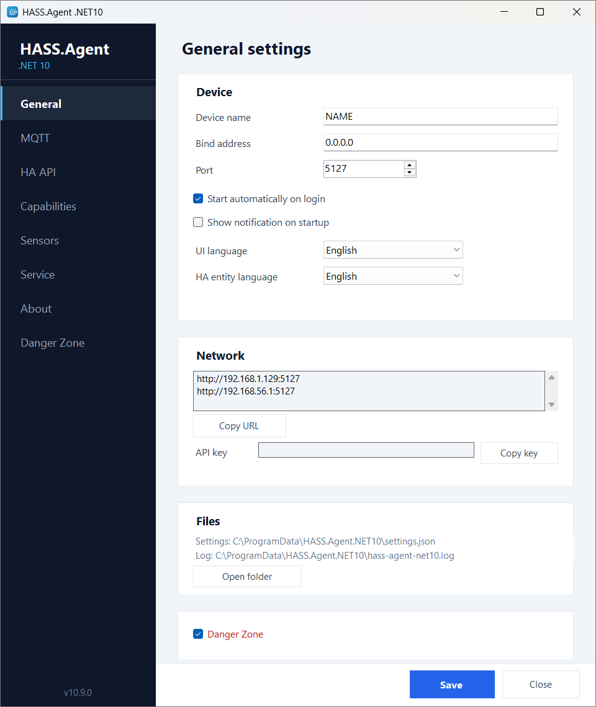

# HASS.Agent .NET10


[](https://v1k70rk4.github.io/HASS.Agent.NET10/)
[](https://ko-fi.com/v1k70rk4)


A modern Windows companion app for Home Assistant.

🌐 **[Website & screenshots](https://v1k70rk4.github.io/HASS.Agent.NET10/)**

> ⭐ **Enjoying HASS.Agent?** Please star this repo — and the [Home Assistant integration](https://github.com/v1k70rk4/HASS.Agent.NET10-Integration) too. It helps others find the project and keeps it going!
>
> ☕ If HASS.Agent saved you an evening of tinkering, you can [buy me a coffee on Ko-fi](https://ko-fi.com/v1k70rk4). Everything stays free — it just helps cover things like the code signing certificate.

**HASS.Agent .NET10** began as a fork of the classic [HASS.Agent](https://github.com/LAB02-Research/HASS.Agent) and has grown into a project of its own: a lightweight .NET 10 client built for current Windows desktops. The original client was a .NET 6-era application; this one focuses on a smaller, cleaner runtime, Home Assistant integration via MQTT or WebSocket API, Windows 11-friendly UX, and a split tray app/system service model.

It is designed for Windows PCs you want to observe and control from Home Assistant: media playback, notifications, sensors, shutdown/restart, command buttons, and rich machine state.

The .NET10 line starts at **version 10.0.0**. The classic client is a separate program: if you want to stay with it, it is still available from its own project, and the integration keeps a [`legacy` branch](https://github.com/v1k70rk4/HASS.Agent.NET10-Integration/tree/legacy) for it. Thinking about switching? See [Coming from HASS.Agent](docs/migrating.md).

> **Stable:** [10.8.0](https://github.com/v1k70rk4/HASS.Agent.NET10/releases/latest) &nbsp;·&nbsp; **Beta:** [10.9.0-beta.2](https://github.com/v1k70rk4/HASS.Agent.NET10/releases/tag/v10.9.0-beta.2) &nbsp;·&nbsp; [What changed](#what-changed) &nbsp;·&nbsp; [Full changelog](CHANGELOG.md)

---

## Install

### Requirements

- Windows 10 version 2004 / build 19041 or newer
- Windows 11 recommended
- x64 Windows
- Home Assistant with **MQTT broker** (recommended, e.g. Mosquitto) **or HA API** (WebSocket, e.g. via Nabu Casa)
- The companion Home Assistant integration:
  [v1k70rk4/HASS.Agent.NET10-Integration](https://github.com/v1k70rk4/HASS.Agent.NET10-Integration) —
  **version 10.6.7 or newer**; the sensors added in 10.7.1 need integration **10.7.0** to appear in
  Home Assistant (the agent and the integration are released with matching version numbers, so keep
  them in step)

Windows versions older than Windows 10 2004 are intentionally blocked. The app targets `net10.0-windows10.0.19041.0` and uses modern Windows APIs for notifications, media sessions, services, sensors, and desktop state.

If you download a published self-contained build, you do **not** need to install the .NET runtime separately. If you want to build from source, install the **.NET 10 SDK**.

### Quick Start

1. Install the Home Assistant integration, [v1k70rk4/HASS.Agent.NET10-Integration](https://github.com/v1k70rk4/HASS.Agent.NET10-Integration). It is in the **HACS default store**, so no custom repository is needed: open HACS, search for **HASS.Agent** (or use the button), download it and restart Home Assistant.

   [](https://my.home-assistant.io/redirect/hacs_repository/?owner=v1k70rk4&repository=HASS.Agent.NET10-Integration&category=integration)
2. Download the signed installer from [Releases](https://github.com/v1k70rk4/HASS.Agent.NET10/releases) (see [Code Signing](#code-signing)), or [build from source](docs/development.md#build-from-source).
3. Run the installer or start `HASS.Agent.NET10.exe` directly.
4. Open the tray icon and go to settings.
5. On the **MQTT** page, enable MQTT and enter your broker address and credentials.
   Alternatively, on the **HA API** page, enable the WebSocket connection to Home Assistant (useful for remote access via Nabu Casa or when no MQTT broker is available).
6. On the **Capabilities** page, choose which features are handled by the tray app vs. the service.
7. On the **Sensors** page, enable built-in sensors and add custom sensors.
8. Optionally install the Windows service from the **Service** page.
9. The PC turns up on its own under **Discovered** in **Settings → Devices & services** of Home Assistant; click **Add** there. To add it by hand instead:

   [](https://my.home-assistant.io/redirect/config_flow_start/?domain=hass_agent)

The integration creates the Home Assistant entities from what the agent advertises, so what you switch on or off in the settings appears and disappears there on its own.

### Installer

The setup package is built with [Inno Setup](https://jrsoftware.org/isinfo.php). Options during install:

- **Desktop icon** (optional)
- **Start automatically on login** (default: enabled, sets a registry Run key)
- **Install system service** (optional)
- **Clean install** (removes existing settings, API key, and log files — useful for a fresh start)

The installer automatically configures a **Windows Firewall** rule (Private profile, TCP port 5115) for the Local HTTP API, so manual firewall setup is not needed.

During upgrades the installer stops the running tray app, stops the system service if installed, replaces the files, reinstalls/starts the service, and restarts the tray app. On uninstall the firewall rule is removed automatically.

---

## Features

| | What it does | Details |
|---|---|---|
| <a id="notifications"></a>**Notifications** | Home Assistant notifications as Windows notifications or in the app's own always-visible window, with pictures, buttons and text fields; what is pressed and typed comes back to Home Assistant as an event. | [Notifications](docs/features.md#notifications) |
| <a id="media-player"></a>**Media player** | The active Windows media session as a `media_player`: title, play / pause, skip, seek, volume, TTS. | [Media Player](docs/features.md#media-player) |
| <a id="sensors"></a><a id="built-in-sensors"></a>**Sensors** | Built-in system sensors (CPU, memory, drives, network, battery, session, GPU, camera and microphone in use, and more), each with its own polling profile. | [Sensors](docs/sensors.md) |
| <a id="custom-sensors"></a>**Custom sensors** | Your own: a process, a service, a drive, an attribute of a built-in sensor, the output of a command or script, a LibreHardwareMonitor value (beta). | [Custom Sensors](docs/sensors.md#custom-sensors) |
| <a id="system-commands"></a>**System commands** | Lock, sleep, monitor off, volume, shutdown, restart as buttons and a service call; Hibernate and Log off in the beta. | [System Commands](docs/commands.md#system-commands) |
| <a id="custom-commands"></a>**Custom commands** | Your own buttons: programs, PowerShell scripts, key presses, links, popup windows. | [Custom Commands](docs/commands.md#custom-commands) |
| **Dashboard popup** | A Home Assistant dashboard, or any web page, in a small window above the tray. | [Dashboard Popup](docs/features.md#dashboard-popup) |
| **Display and audio** (beta) | The screen as a light in Home Assistant, the default audio device as a select, the volume of a single app. | [Display and Audio](docs/features.md#display-and-audio) |
| **Hotkeys** (beta) | A named key combination becomes an event in Home Assistant, to start automations from the keyboard. | [Hotkeys](docs/features.md#hotkeys) |
| <a id="windows-service"></a>**Windows service** | The same program as a system service, for what should work with nobody logged in. | [Windows Service](docs/features.md#windows-service) |
| <a id="updating-from-home-assistant"></a>**Updates from Home Assistant** | An update entity with a working Install button; silent when the service is installed. | [Updating](docs/features.md#updating-from-home-assistant) |
| <a id="danger-zone"></a>**Danger Zone** | Opt-in toolbox: MQTT cleanup, live monitor, debug log, backup / restore, factory reset, beta updates. | [Danger Zone](docs/features.md#danger-zone) |
| <a id="connection-modes"></a><a id="home-assistant-integration"></a>**Connection** | MQTT, the Home Assistant WebSocket API, or both with automatic failover; a notification-only local HTTP API as a fallback. | [Connection Modes](docs/connection.md#connection-modes) |

<p align="center"></p>

## Documentation

- [Features in detail](docs/features.md): notifications, media player, dashboard popup, display and audio, hotkeys, Windows service, updates, Danger Zone
- [Commands](docs/commands.md): system commands and custom commands, with the key names
- [Sensors](docs/sensors.md): the built-in sensors, their attributes and polling profiles, custom sensors
- <a id="mqtt-topics"></a><a id="ha-api-websocket-events"></a><a id="local-http-api"></a><a id="windows-firewall"></a>[Connecting to Home Assistant](docs/connection.md): connection modes, MQTT topics, HA API events, the local HTTP API, the firewall rule
- <a id="build-from-source"></a><a id="minimal-development-setup"></a>[Building and development](docs/development.md): build from source, GitHub Actions, development setup
- [Coming from HASS.Agent](docs/migrating.md): what is the same, what is different, how to switch
- [Changelog](CHANGELOG.md): every release
- [Home Assistant integration](https://github.com/v1k70rk4/HASS.Agent.NET10-Integration): entities, services, events

---

## Code Signing

Starting with 10.6.8, the release assets (`HASS.Agent.NET10-Setup-<version>.exe`, its uninstaller, and `HASS.Agent.NET10.exe` in the zip) are signed with a Certum *Open Source* code signing certificate:

| | |
|---|---|
| Issued to | `Open Source Developer Viktor Révész` |
| Issued by | `Certum Code Signing 2021 CA` |
| SHA-1 thumbprint | `0C09522639318AF1069507568599DFC5B7F86EE4` |
| Timestamp | `time.certum.pl` (the signature stays valid after the certificate expires) |

To check a download, open its **Properties → Digital Signatures** tab, or from the Windows SDK:

```powershell
signtool verify /pa /v HASS.Agent.NET10-Setup-10.6.8.exe
```

Signing happens on the maintainer's machine through SimplySign, unlocked with a one-time code from the SimplySign app; the private key lives in Certum's cloud HSM and is never exported. The GitHub Actions build itself is unsigned — the signed files replace its assets on the release. A certificate this new has no SmartScreen reputation yet, so Windows may still show a *"Windows protected your PC"* prompt for a while; the publisher name on that prompt is what confirms the file is genuine.

## Privacy Policy

This program will not transfer any information to other networked systems unless specifically requested by the user or the person installing or operating it.

HASS.Agent .NET10 communicates only with:

- the **Home Assistant instance and/or MQTT broker configured by the user**, to provide its core functionality,
- the **GitHub API** (`api.github.com` / `github.com`), to check for application updates and download release assets.

No telemetry, analytics, or usage data is collected or transmitted.

---

## What Changed

### 10.9.0-beta.2

> **Beta.** Out on the beta channel: tick **Beta updates** on the Danger Zone page to be offered it, or take it from the [releases page](https://github.com/v1k70rk4/HASS.Agent.NET10/releases). The current stable release is **10.8.0**, below. The Home Assistant side of the new entities (display light, audio selects, hotkeys, `set_app_volume`) is in the integration's **10.9.0-beta.2**: in HACS, open the integration, choose **Redownload**, turn on **Show beta versions** and pick it. The stable 10.9.0 of both is not out yet.

Works with the Home Assistant integration **10.6.7** or newer; the display light needs integration **10.9.0**. Signed release.

**New since beta.1**

- **Notifications as Windows notifications, with pictures and text fields.** A notification from Home Assistant is now a real Windows notification by default: it follows Do not disturb, stays in the notification centre, and can carry a picture (`image`), up to five buttons, and text fields (`inputs`) whose content comes back to Home Assistant with the pressed button. The app's own window stays as the other **Notification style** on the Capabilities page, for a notification that is visible whatever Windows is doing; it shows the same picture and text fields, and it no longer takes the keyboard focus when it appears. A single notification can pick its style with `style: window` or `style: toast`, so the doorbell can always use the window. Until now a notification without buttons was a tray balloon and one with buttons the app's window. The picture can be a web address; with the integration 10.9.0-beta.2 also a path on Home Assistant or a camera entity. See [Notifications](docs/features.md#notifications).
- **The update report also arrives after a downgrade.** The installer now tells the service which version it replaced, so the "updated from X to Y" notification is sent when the previous version was older than 10.9.0, or was installed over a newer one.

**From beta.1**

- **The display as a light in Home Assistant** (integration 10.9.0+). Turn on the new **Display brightness** sensor (tray app, off by default) and the PC gets a *Display* light: its brightness slider sets the screen brightness, off switches the monitor off, on wakes it. It works with what Windows itself offers: the built-in panel of a laptop, and external monitors that speak DDC/CI. With an older integration the sensor does nothing. With no adjustable display (many TVs, some docks) the light is a plain on/off one, without the slider.
- **Choose the audio device from Home Assistant** (integration 10.9.0+). The *Audio output device* sensor now comes with a select that makes another playback device the default, for "switch to the headset" or "sound to the TV" automations. The new **Audio input device** sensor (off by default) does the same for the recording device.
- **Hotkeys that reach Home Assistant** (integration 10.9.0+). On the Capabilities page you can list key combinations with a name (`ctrl+alt+h` as "Meeting"); pressing one sends an event to Home Assistant, where the device's new *Hotkeys* event entity triggers automations on it. Only the listed combinations are registered with Windows, nothing else that is typed is seen.
- **Per-app volume from Home Assistant** (integration 10.9.0+). Turn on the new **Audio sessions** sensor and the apps in the Windows volume mixer show up as its attributes (name, volume, muted, playing); the integration's `hass_agent.set_app_volume` service sets the volume or mutes one of them, for "turn the game down when the doorbell rings". The state is how many apps play right now.
- **Hibernate and Log off commands.** Two more buttons for Home Assistant, off by default on the Capabilities page.
- **Hardware sensors through LibreHardwareMonitor.** A new custom sensor type reads CPU and GPU temperature, fan speed, voltage and load from a running [LibreHardwareMonitor](https://github.com/LibreHardwareMonitor/LibreHardwareMonitor) (its Remote Web Server). The editor lists every value it reports and fills in the unit; a *Connection...* button sets the address and the login if it asks for one. The agent itself stays free of vendor-specific hardware code. See [Custom Sensors](docs/sensors.md#custom-sensors).
- **The service reports a finished update.** After an update installed with nobody logged in, the "updated from X to Y" notification used to wait for somebody to log in, because only the tray app sent it. The service now sends it when no tray app is running.
- **Quieter log without an audio output.** A PC with no default audio output (an HDMI output whose screen is off) logged three warnings on every poll. It is now logged once when it starts and once when a device is back.

### 10.8.0

Works with the Home Assistant integration **10.6.7** or newer. Signed release.

- **Custom commands and custom sensors get an editor window.** Adding one, or double-clicking a row, opens a window with room for a long command line, a description and an example for the chosen type, a *Browse* button for programs and scripts, and a *Test* button: a command runs right away and says what went wrong if it did, a sensor shows the value it would report. For sensors the parameter field also lists what the PC has: the running processes, the installed services, the drives, or the attributes of the built-in sensors. The tables on the settings pages are now just the overview, with the ticks still one click away.
- **Dashboard popup (WebView).** A Home Assistant dashboard, or any web page, in a small window above the tray: set its address and size on the **Capabilities** page, then open it from the tray menu, or with a click on the tray icon if you tick that. It closes when you click elsewhere, and nothing is loaded while it is closed. There is a matching custom command type, *Popup window (WebView)*, that shows a page in a window of its own, for example a camera when the doorbell rings. Both use the WebView2 runtime that ships with Windows 11; the login is kept per Windows user. Off until an address is set.
- **Two new custom command types: *Key press* and *Open address*.** A custom command can now press keys (`win+r`, `ctrl+shift+esc`, `alt+tab`, media and browser keys, or several combinations in a row) or open a link in the default browser, without a script written for it. Both show up in Home Assistant as buttons like any other custom command, and both run in the tray app, since they act on the desktop of the logged-in user. The key names are listed under [Custom Commands](docs/commands.md#custom-commands).

Older versions are in the [changelog](CHANGELOG.md).

---

## Status

This is a project of its own, not the original LAB02 release line, and it is not affiliated with it. It began as a fork of HASS.Agent and has been developed independently since.

The goal is a focused Windows/Home Assistant companion that keeps the useful HASS.Agent ideas, drops legacy weight, and is built around .NET 10, MQTT or the HA API, and a tray app/service split. The classic client stays with its own project; the integration keeps a [`legacy` branch](https://github.com/v1k70rk4/HASS.Agent.NET10-Integration/tree/legacy) for it.

## License

MIT
