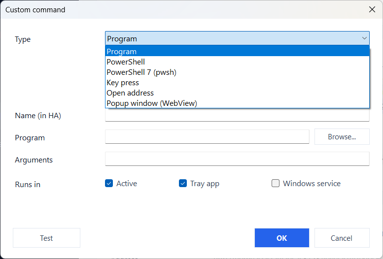

# Commands

[← Back to the README](https://github.com/v1k70rk4/HASS.Agent.NET10#readme)

## System Commands

Control the PC from Home Assistant via button entities or service calls:

| Command | Description | Service capable |
|---------|------------|:-:|
| `lock` | Lock workstation | |
| `sleep` | Suspend | |
| `monitor_off` | Turn off monitors | |
| `volume_up` | Volume +5% | |
| `volume_down` | Volume -5% | |
| `toggle_mute` | Toggle mute | |
| `shutdown` | Shutdown (with delay) | yes |
| `restart` | Restart (with delay) | yes |
| `restart_cancel` | Cancel pending shutdown/restart | yes |

Shutdown and restart support configurable delay, force mode, and translated comments:

```yaml
action: hass_agent.execute_command
data:
  device_name: MY-PC
  command: restart
  force: true
  time: 30
  comment: "Restarted from Home Assistant"
```

## Custom Commands

Beyond the built-in commands, you can define your own in the **Capabilities** window. Each custom command becomes a button in Home Assistant. **Add**, or a double click on a row, opens the editor; its **Test** button runs the command right away, in the tray app.

<p align="center"></p>

| Type | `Command / script` field | `Arguments` field |
|------|--------------------------|-------------------|
| **Program** | Executable path or name (e.g. `notepad.exe`, `C:\Tools\backup.exe`), or a full command line (e.g. `taskkill /F /IM app.exe /T`) | Command-line arguments (optional; can also be put inline in the command field) |
| **PowerShell** | Inline command, or a `.ps1` path | Script arguments (used only for `.ps1`) |
| **PowerShell 7 (pwsh)** | Same as PowerShell, run with `pwsh.exe` | Same as PowerShell |
| **Key press** | One or more key combinations, separated by spaces or commas (e.g. `win+r`, `ctrl+shift+esc`, `ctrl+c ctrl+v`) | Not used |
| **Open address** | A link to open in the default browser (e.g. `https://example.com`), or an app link such as `ms-settings:display` | Not used |
| **Popup window (WebView)** | A web address (`http://` or `https://`) to show in a window of its own | Window size, e.g. `1024x720` (optional) |

- **Program** commands launch via the shell, so GUI apps show in your session; PowerShell runs hidden with `-NoProfile -ExecutionPolicy Bypass`.
- Tick **Tray**, **Svc**, or both to choose where a command runs. Service-run commands execute in the `SYSTEM` session (no visible UI).
- **Key press**, **Open address** and **Popup window** act on the desktop of the logged-in user, so they run in the tray app only; the **Svc** tick is cleared for them on save.
- **Key names:** letters and digits as they are, plus `ctrl`, `shift`, `alt`, `win`, `enter`, `esc`, `tab`, `space`, `backspace`, `delete`, `insert`, `home`, `end`, `pageup`, `pagedown`, `up`, `down`, `left`, `right`, `f1`-`f24`, `num0`-`num9`, `printscreen`, `pause`, `capslock`, `numlock`, `scrolllock`, `menu`, `plus`, `minus`, `comma`, `period`, `play_pause`, `next_track`, `prev_track`, `media_stop`, `volume_up`, `volume_down`, `volume_mute`, `browser_back`, `browser_forward`, `browser_refresh`, `browser_home`. Keys in a combination are joined with `+`. Windows does not let a normal program send keys to a window that runs as administrator, or to the lock screen.
- **Security:** you own the command list — Home Assistant only sends the command's id to trigger it, never the program or script itself. It cannot run arbitrary code on your PC. Requires the HA integration 10.6.0+ to show the buttons.
