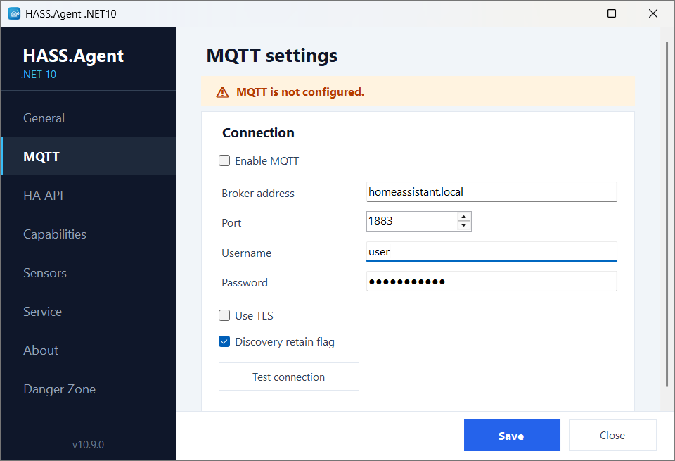
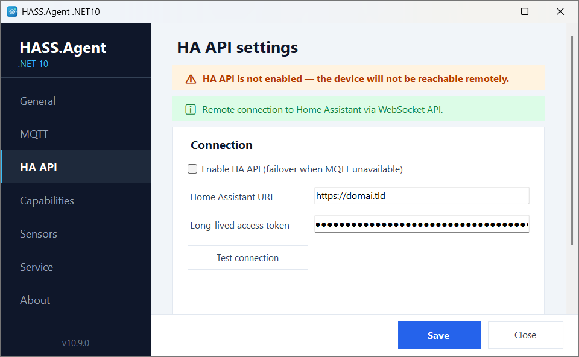

# Connecting to Home Assistant

[← Back to the README](https://github.com/v1k70rk4/HASS.Agent.NET10#readme)

The Home Assistant side is the companion integration, [v1k70rk4/HASS.Agent.NET10-Integration](https://github.com/v1k70rk4/HASS.Agent.NET10-Integration), installed from HACS; the steps are in the [Quick Start](https://github.com/v1k70rk4/HASS.Agent.NET10#quick-start). The integration creates Home Assistant entities dynamically based on the agent's advertised capabilities.

## Connection Modes

The agent supports three connection modes. You can use MQTT and HA API together — HA API acts as an automatic failover when the MQTT broker is unreachable.

| Feature | MQTT | HA API (WebSocket) | Local HTTP API |
|---------|:----:|:------------------:|:--------------:|
| Notifications | yes | yes | yes |
| Media player | yes | yes | |
| Notification action events | yes | yes | |
| System sensors | yes | yes | |
| Command buttons | yes | yes | |
| Update entity | yes | yes | |
| Auto-discovery | yes | yes | |
| Service integration | yes | yes | |
| Retained state on restart | yes | | |
| Last Will (offline detection) | yes | | |
| Remote access (Nabu Casa) | | yes | |

**MQTT** (recommended) — The device is discovered automatically via MQTT discovery. All features work. Requires an MQTT broker on the local network (e.g. Mosquitto). If you use Zigbee2MQTT, you already have one.

**HA API (WebSocket)** — The agent connects directly to Home Assistant's WebSocket API using a long-lived access token. Works remotely (e.g. via Nabu Casa) without an MQTT broker. Almost all features work, with some trade-offs: no retained state (sensor values are lost until the agent reconnects after a restart), no MQTT Last Will (no automatic offline detection), and media thumbnails are ~33% larger (base64 encoding). HTTPS is required for remote access.

### A Home Assistant user for the PC

> From 10.9.1, with the integration 10.9.1 or newer.

The token in the **HA API** settings belongs to a Home Assistant user, and works with that user's rights. Give the PC a user of its own who is **not an administrator**: if the PC is ever broken into, its token then cannot install add-ons, read `secrets`, change users or the configuration. (Any Home Assistant user can still see states and call actions; Home Assistant has no finer permissions than that.)

The **HA API** page shows whose the token is, under the token field.

**The easy way:** connect with your own (administrator's) token as usual. When the app's window opens, it offers to create a user for this PC; the same is the **Create a user for this PC** button next to the line under the token. The integration makes a Home Assistant user named *HASS.Agent* and the PC's name, who is not an administrator and has no password (nobody can log in with it), gives it a token, and the app switches to it. Your administrator token stays in Home Assistant: delete it in your profile (**Security**) if nothing else uses it. Deleting the PC's user later cuts the PC off until it gets a token again.

**By hand**, if you would rather not put an administrator's token on the PC even once:

1. In Home Assistant, **Settings → People → Add person**: a name such as *hass-agent-office-pc*, **Allow login** on, **Administrator** off.
2. Log in as that user once, open its profile, **Security** tab, and create a **long-lived access token** at the bottom.
3. Put the token in the **HA API** page of the app.

Home Assistant then asks an administrator once: a new PC shows up under **Settings → Devices & services → Discovered**; a PC already set up that now uses another user asks for that user to be allowed. Until then the PC's messages are refused, and the log says why. An administrator's token keeps working as before, without the question.

The very first PC of a Home Assistant that has no HASS.Agent device yet: add it with **Add integration → HASS.Agent → HA API (WebSocket)** and keep that dialog open while the app connects.

**Local HTTP API** — A minimal fallback. The agent runs a small HTTP server that Home Assistant connects to. Only notifications are supported. Requires manual setup (IP address, port, API key). Use MQTT or HA API instead for full functionality.

<p align="center"></p>
<p align="center"></p>

## MQTT Topics

Published by the agent:

```text
hass.agent/devices/{serialNumber}                   # discovery + capabilities
hass.agent/system/{serialNumber}/state              # service online state
hass.agent/sensors/{serialNumber}/state             # sensor values
hass.agent/update/{serialNumber}/state              # app update state
hass.agent/media_player/{serialNumber}/state        # media player state
hass.agent/notifications/{serialNumber}/actions     # notification action events
hass.agent/hotkeys/{serialNumber}/pressed           # hotkey presses (10.9.0+)
homeassistant/update/{serial}/hass_agent_net10/config  # HA update entity discovery
```

Subscribed by the agent:

```text
hass.agent/notifications/{serialNumber}             # incoming notifications
hass.agent/media_player/{serialNumber}/cmd          # media player commands
hass.agent/buttons/{serialNumber}/cmd               # system command buttons
hass.agent/system/{serialNumber}/cmd                # service-routed commands
```

**Keep the broker login to yourself.** MQTT has no idea who sent a message: anything that can log in to the broker can publish to these topics, so it can send this PC notifications, shut it down, or run the commands you set up for it, and read what is typed into a notification. With the Mosquitto add-on that is every login it accepts: Home Assistant users included, and the one a Zigbee bridge or an ESP device uses. Use a login of its own for HASS.Agent, don't put it on devices you don't trust, and change it if it got out. To go further, Mosquitto's ACLs can limit who may write `hass.agent/+/{serialNumber}/cmd` and `hass.agent/notifications/{serialNumber}`. The HA API does not have this problem: there, every PC has its own Home Assistant user and gets only its own commands.

## HA API WebSocket Events

When using HA API mode, the agent communicates through Home Assistant's event bus instead of MQTT topics.

With the integration 10.9.1 or newer the agent sends its events with the integration's `hass_agent/fire` command and receives its commands with `hass_agent/subscribe`, which only carries the commands for its own serial number. Both work with a token of a user who is not an administrator (see [A Home Assistant user for the PC](#a-home-assistant-user-for-the-pc)). With an older integration it falls back to `fire_event` and `subscribe_events`, which need an administrator's token.

Events fired by the agent:

```text
hass_agent_device_update          # discovery + capabilities (tray app)
hass_agent_service_update         # Windows service status + capabilities
hass_agent_update_state           # available app update (drives the update entity)
hass_agent_sensor_update          # sensor values
hass_agent_media_update           # media player state
hass_agent_media_thumbnail        # media thumbnail (base64)
hass_agent_notification_action    # notification button press
hass_agent_hotkey                 # hotkey press (10.9.0+)
```

Commands sent by the integration to the agent:

```json
{
  "serial_number": "agent-serial",
  "command_type": "notification | media_command | button_command | update_install",
  "target": "app | service",
  "payload": { }
}
```

`target` names which side should act on a button command — the tray app or the Windows
service — the same choice MQTT makes by picking a topic. It is optional: without it each
side falls back to deciding for itself, which is how integrations older than 10.6.5 behave.

All events and commands are targeted by `serial_number`, so renaming the device in Home Assistant does not break routing.

## Local HTTP API

The agent runs a lightweight HTTP server on port `5115`. This is used by the Local HTTP API integration mode and for device info.

**Endpoints:**

| Method | Path | Auth | Description |
|--------|------|:----:|-------------|
| `GET` | `/info` | | Device info and capabilities |
| `POST` | `/notify` | Bearer | Send a notification |

The `POST /notify` endpoint requires an API key via the `Authorization: Bearer <key>` header. The key is auto-generated on first launch and displayed on the **General** settings page under **Network**. Copy it from there when setting up the Local HTTP API integration in Home Assistant.

```powershell
# Test from the local machine
Invoke-RestMethod http://localhost:5115/info

# Test notification with API key
$headers = @{ Authorization = "Bearer YOUR_API_KEY_HERE" }
$body = @{ message = "Test"; title = "Hello" } | ConvertTo-Json
Invoke-RestMethod http://localhost:5115/notify -Method Post -Body $body -ContentType "application/json" -Headers $headers
```

> **Note**: `GET /info` is intentionally unauthenticated so the Home Assistant config flow can validate the connection. It only returns the device name, serial number, and capability flags.

Settings and API key are stored in:

```text
C:\ProgramData\HASS.Agent.NET10\settings.json
```

## Windows Firewall

> **Note**: If you used the installer, the firewall rule is already configured automatically. This section is only needed for manual (non-installer) setups.

The agent's Local HTTP API listens on TCP port `5115`. If you run the app without the installer, allow Home Assistant to reach it from your local network:

```powershell
New-NetFirewallRule `
  -DisplayName "HASS.Agent .NET10 Local API" `
  -Direction Inbound `
  -Action Allow `
  -Protocol TCP `
  -LocalPort 5115 `
  -Profile Private
```

Keep your Windows network profile set to **Private** for your home LAN. Avoid opening this port on Public networks.
