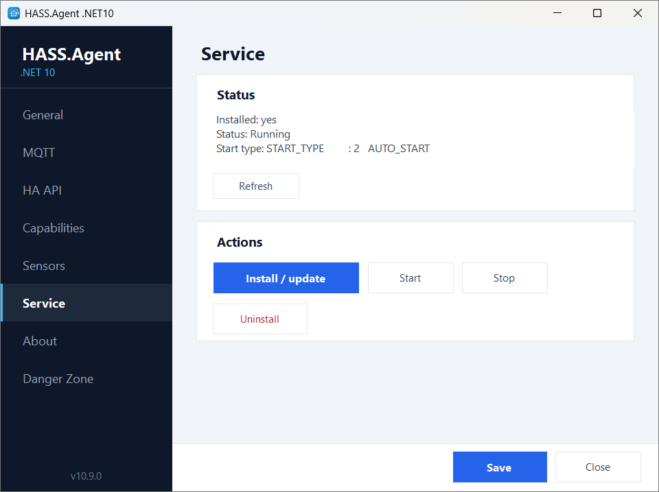
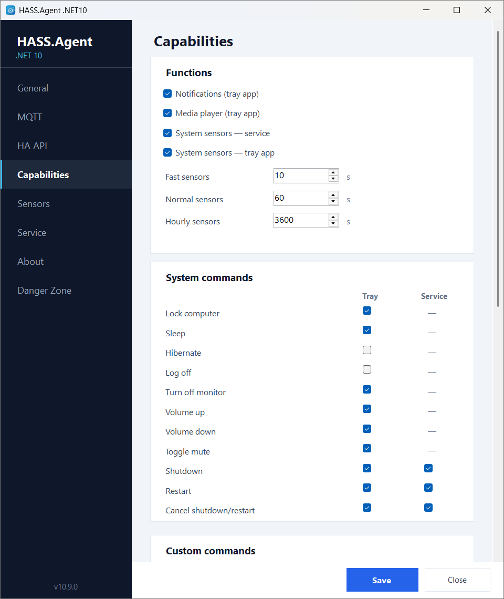
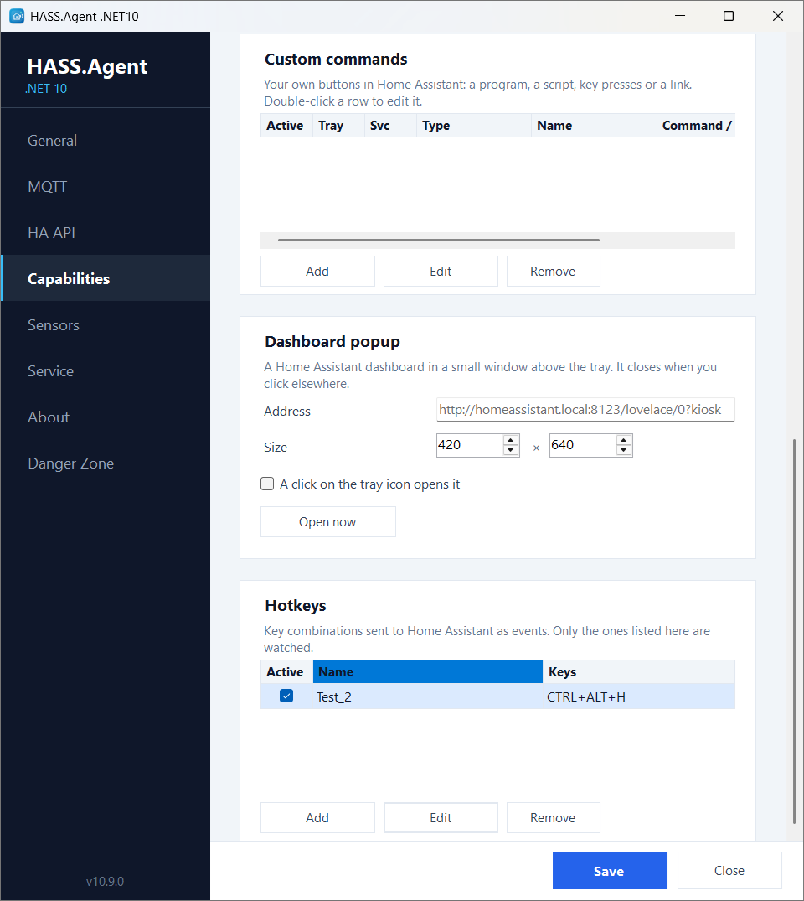
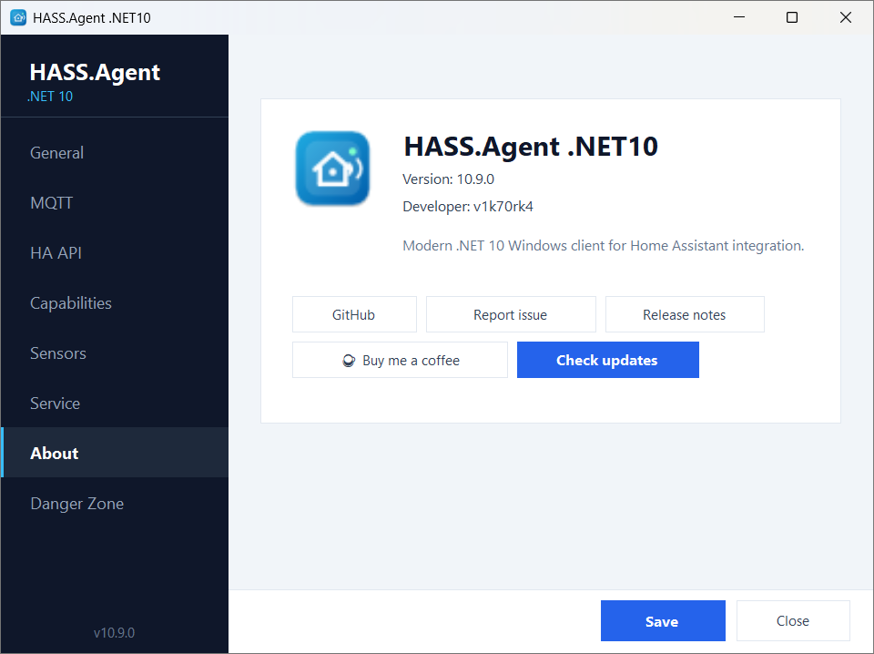
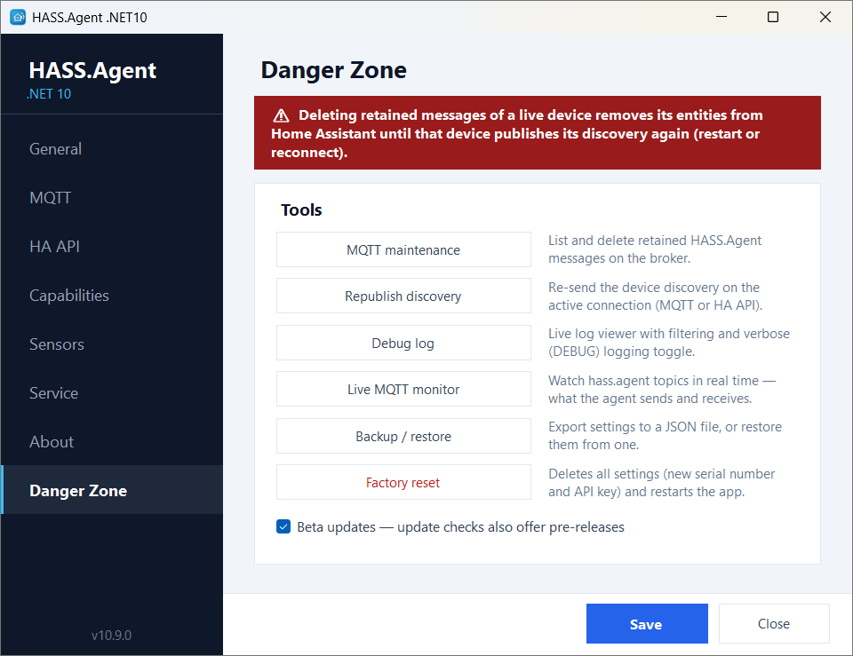

# Features in detail

[← Back to the README](https://github.com/v1k70rk4/HASS.Agent.NET10#readme)

## Notifications

Receive Home Assistant notifications on Windows as tray balloon tips or actionable popup windows.

Supports actionable notifications: buttons in the popup can publish an action event back to Home Assistant, so automations can react to user choices.

```yaml
action: hass_agent.send_notification
target:
  entity_id: notify.my_pc_notifications
data:
  title: Home Assistant
  message: "Would you like to turn on the lights?"
  data:
    actions:
      - action: lights_on
        title: "Turn on"
      - action: lights_off
        title: "Turn off"
```

Button presses are published to MQTT and appear as an event entity in Home Assistant.

## Media Player

Expose the active Windows media session to Home Assistant as a `media_player` entity:

- current title, artist, album
- play / pause / stop
- next / previous track
- seek
- volume and mute control
- TTS playback (Home Assistant TTS engine generates audio URL, agent plays it)

The media player uses Windows global media transport sessions for playback control and the default Windows audio endpoint for volume/mute.

## Dashboard Popup

A Home Assistant dashboard, or any web page, in a small window above the tray. Set its address and size on the **Capabilities** page, then open it from the tray menu, or with a click on the tray icon if you tick that. It closes when you click elsewhere, and nothing is loaded while it is closed. Off until an address is set.

There is a matching custom command type, *Popup window (WebView)*, that shows a page in a window of its own, for example a camera when the doorbell rings; see [Custom Commands](commands.md#custom-commands).

Both use the WebView2 runtime that ships with Windows 11; the login is kept per Windows user.

## Display and Audio

> In the 10.9.0 beta. The Home Assistant side needs the integration 10.9.0-beta.1 or newer.

- **The display as a light.** Turn on the **Display brightness** sensor (tray app, off by default) and the PC gets a *Display* light in Home Assistant: its brightness slider sets the screen brightness, off switches the monitor off, on wakes it. It works with what Windows itself offers: the built-in panel of a laptop, and external monitors that speak DDC/CI. With no adjustable display (many TVs, some docks) the light is a plain on/off one, without the slider.
- **The default audio device as a select.** The *Audio output device* sensor comes with a select that makes another playback device the default, for "switch to the headset" or "sound to the TV" automations. The **Audio input device** sensor (off by default) does the same for the recording device.
- **Per-app volume.** Turn on the **Audio sessions** sensor and the apps in the Windows volume mixer show up as its attributes (name, volume, muted, playing); the state is how many apps play right now. The integration's `hass_agent.set_app_volume` service sets the volume or mutes one of them:

```yaml
action: hass_agent.set_app_volume
data:
  device_name: MY-PC
  app: spotify
  volume: 30
```

## Hotkeys

> In the 10.9.0 beta. The Home Assistant side needs the integration 10.9.0-beta.1 or newer.

On the **Capabilities** page you can list key combinations with a name (`ctrl+alt+h` as "Meeting"). Pressing one sends an event to Home Assistant, where the device's *Hotkeys* event entity has one event type per hotkey name, so an automation can trigger on it. The press also fires `hass_agent_hotkey_pressed` on the event bus, with the name in `hotkey`.

A hotkey is one combination: at least one of `ctrl`, `alt`, `shift`, `win`, and exactly one other key. The key names are the ones listed under [Custom Commands](commands.md#custom-commands). Only the listed combinations are registered with Windows, nothing else that is typed is seen.

## Windows Service

The same executable can run as a tray app or as a Windows service. Use the **Service** page to install, start, stop, or uninstall the service (UAC elevation is requested automatically).

**Service** handles features that should work even when nobody is logged in:
- shutdown, restart, restart_cancel
- system sensors (CPU, memory, disk, network, etc.)
- custom sensors (process, service, disk)

**Tray app** handles interactive user-session features:
- notifications
- media player
- active window/process sensors
- clipboard, audio, monitor state
- user session details

Use the **Capabilities** page to choose which role handles each feature.

<p align="center"></p>

<p align="center"></p>

<p align="center"></p>

## Updating from Home Assistant

When a new release is available, the agent publishes an **update entity** to Home Assistant with a working **Install** button and a **Check for updates** button next to it. With integration 10.7.3 or newer the integration builds the entity on both transports; with an older integration it comes from Home Assistant's own MQTT discovery (and, on the HA API transport, from the agent's events, 10.6.7+). With the Windows service installed, the update is downloaded and applied **fully silently** (no UAC prompt), also when nobody is logged in; otherwise a UAC prompt appears on the PC. Home Assistant receives a **persistent notification** for the progress and result.

<p align="center"></p>
<p align="center"></p>

You can also check for updates manually from the **About** page, which shows the installed version, the latest release, and a one-click update download.

<p align="center"></p>

## Danger Zone

An opt-in maintenance and diagnostics toolbox. Enable it with the **Danger Zone** checkbox on the General page and a new tab appears with the following tools:

| Tool | What it does |
|------|--------------|
| **MQTT maintenance** | Lists every retained HASS.Agent message on the broker (this device's or all devices') and deletes the selected ones — the cure for ghost entities after renames or reinstalls. |
| **Republish discovery** | Re-sends the device discovery on the active connection (MQTT or HA API) without restarting the app. |
| **Debug log** | Live log viewer with filtering, plus a verbose toggle that enables DEBUG-level logging (including every sent/received MQTT message) until the next restart. |
| **Live MQTT monitor** | Watches the `hass.agent/#` topics in real time with a payload preview — see exactly what the agent sends and receives. |
| **Backup / restore** | Exports the settings to a portable JSON file and restores them from one. DPAPI-protected secrets (MQTT password, HA API token) are machine-bound and excluded. |
| **Factory reset** | Deletes all settings after a double confirmation and restarts the app with a fresh serial number and API key. |

The Danger Zone also hosts the **beta updates** toggle: when enabled, update checks include GitHub pre-releases, so you can follow the beta channel. Stable users are never offered pre-releases.

<p align="center"></p>

<p align="center"></p>
