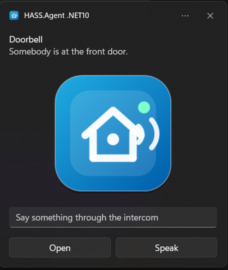
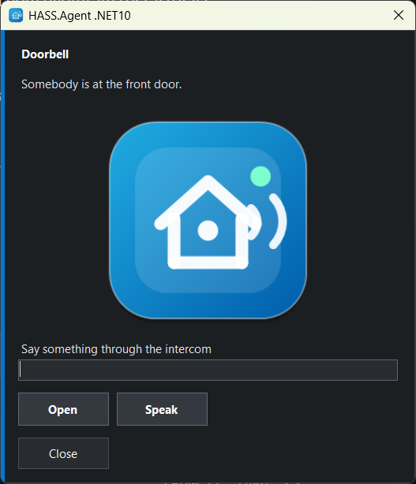
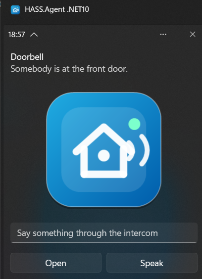

# Features in detail

[← Back to the README](https://github.com/v1k70rk4/HASS.Agent.NET10#readme)

## Notifications

Receive Home Assistant notifications on Windows, as a Windows notification or in the app's own window.

<p align="center"> </p>

Supports actionable notifications: buttons on the notification send an action event back to Home Assistant, so automations can react to user choices.

```yaml
action: hass_agent.send_notification
target:
  entity_id: notify.my_pc_notifications
data:
  title: Home Assistant
  message: "Would you like to turn on the lights?"
  actions:
    - action: lights_on
      title: "Turn on"
    - action: lights_off
      title: "Turn off"
```

Button presses arrive in Home Assistant on the device's *Notification actions* event entity, and as a `hass_agent_notifications` event on the event bus.

### Pictures, text fields and more

> From 10.9.0.

Besides `message` and `title`, the action takes these fields. In the Home Assistant editor each has an input of its own (integration 10.9.0 or newer; with an older one they go inside a `data` object of the action, which still works):

| Field | What it does |
|-------|--------------|
| `actions` | Buttons, each with an `action` (what comes back) and a `title` (what the button says). Up to five. |
| `image` | A picture to show: a web address. With the integration 10.9.0 or newer also a path on Home Assistant (`/local/doorbell.jpg`, `/api/camera_proxy/camera.front_door`) or simply a camera or image entity (`camera.front_door`); the integration makes it fetchable for a few minutes, and the PC keeps its own copy. |
| `inputs` | Text fields, each with an `id` and a `title` (the hint shown in the empty field). Up to five. What was typed comes back with the pressed button, in `input`, by id. With no button of your own, a *Send* button is added, and its action is `reply`. |
| `duration` | Seconds on screen, 1 to 60 (default 10). Windows knows two lengths for its own notifications: above 10 it uses the long one, about 25 seconds. |
| `style` | `toast` or `window`: the [notification style](#notification-style) for this one notification, whatever the setting says. |

```yaml
action: hass_agent.send_notification
target:
  entity_id: notify.my_pc_notifications
data:
  title: Doorbell
  message: "Somebody is at the front door."
  image: camera.front_door
  style: window
  duration: 30
  inputs:
    - id: answer
      title: "Say something through the intercom"
  actions:
    - action: open_door
      title: "Open"
    - action: speak
      title: "Speak"
```

The event for the pressed button then carries what was typed:

```yaml
action: speak
input:
  answer: "Leave it at the door, please"
device_name: MY-PC
```

### Notification style

> From 10.9.0.

The **Notification style** on the Capabilities page decides how a notification is shown:

- **Windows notification** (the default). Windows shows it like any other notification: it follows Do not disturb and focus sessions, it is held back while a full-screen game or a presentation runs, and it stays in the notification centre afterwards, where its buttons still work. If notifications are turned off for HASS.Agent in the Windows settings, the app uses its own window instead.
- **Own window.** A small always-on-top window in the corner of the screen, visible whatever Windows is doing. It does not take the keyboard focus when it appears, and it closes on its own after the duration, unless somebody has started typing into it.

A single notification can choose with `style`, so the doorbell can use the window while everything else stays a Windows notification.

<p align="center"></p>

## Media Player

Expose the active Windows media session to Home Assistant as a `media_player` entity:

- current title, artist, album
- play / pause / stop
- next / previous track
- seek
- volume and mute control
- TTS playback (Home Assistant TTS engine generates audio URL, agent plays it)

The media player uses Windows global media transport sessions for playback control and the default Windows audio endpoint for volume/mute.

## Dashboard Popup

A Home Assistant dashboard, or any web page, in a small window above the tray. Set its address and size on the **Capabilities** page, then open it from the tray menu, or with a click on the tray icon if you tick that. It closes when you click elsewhere, and nothing is loaded while it is closed. Off until an address is set.

There is a matching custom command type, *Popup window (WebView)*, that shows a page in a window of its own, for example a camera when the doorbell rings; see [Custom Commands](commands.md#custom-commands).

Both use the WebView2 runtime that ships with Windows 11; the login is kept per Windows user.

## Display and Audio

> From 10.9.0. The Home Assistant side needs the integration 10.9.0 or newer.

- **The display as a light.** Turn on the **Display brightness** sensor (tray app, off by default) and the PC gets a *Display* light in Home Assistant: its brightness slider sets the screen brightness, off switches the monitor off, on wakes it. It works with what Windows itself offers: the built-in panel of a laptop, and external monitors that speak DDC/CI. With no adjustable display (many TVs, some docks) the light is a plain on/off one, without the slider.
- **The default audio device as a select.** The *Audio output device* sensor comes with a select that makes another playback device the default, for "switch to the headset" or "sound to the TV" automations. The **Audio input device** sensor (off by default) does the same for the recording device.
- **Per-app volume.** Turn on the **Audio sessions** sensor and the apps in the Windows volume mixer show up as its attributes (name, volume, muted, playing); the state is how many apps play right now. The integration's `hass_agent.set_app_volume` service sets the volume or mutes one of them:

```yaml
action: hass_agent.set_app_volume
data:
  device_name: MY-PC
  app: spotify
  volume: 30
```

## Hotkeys

> From 10.9.0. The Home Assistant side needs the integration 10.9.0 or newer.

On the **Capabilities** page you can list key combinations with a name (`ctrl+alt+h` as "Meeting"). Pressing one sends an event to Home Assistant, where the device's *Hotkeys* event entity has one event type per hotkey name, so an automation can trigger on it. The press also fires `hass_agent_hotkey_pressed` on the event bus, with the name in `hotkey`.

A hotkey is one combination: at least one of `ctrl`, `alt`, `shift`, `win`, and exactly one other key. The key names are the ones listed under [Custom Commands](commands.md#custom-commands). Only the listed combinations are registered with Windows, nothing else that is typed is seen.

In the hotkey editor (from 10.9.1) the combination is pressed in its field rather than typed; Backspace clears it. The line under the field says at once whether the combination is free:

- **Taken**: Windows or another program already uses it, so it would never reach HASS.Agent. Windows keeps most `win` combinations for itself (`win+1` … `win+9` open the apps of the taskbar, `win+d`, `win+e`, `win+l` and others), and programs such as Discord, Teams, Steam or a graphics card's overlay register their own. A taken combination is kept only when OK is pressed twice; the app tries it again every minute and it starts working once the other program lets it go. A combination Windows keeps for itself does not even show up in the field.
- **Another hotkey of the list** already has it.
- **Free, with one modifier alone** (`ctrl+c`, `alt+f4`, `shift+a`): Windows gives it, but programs use these themselves, and while HASS.Agent holds one they no longer get it. `ctrl+alt` with a letter, a number or an F key is free on most PCs.

## Windows Service

The same executable can run as a tray app or as a Windows service. Use the **Service** page to install, start, stop, or uninstall the service (UAC elevation is requested automatically).

**Service** handles features that should work even when nobody is logged in:
- shutdown, restart, restart_cancel
- system sensors (CPU, memory, disk, network, etc.)
- custom sensors (process, service, disk)

**Tray app** handles interactive user-session features:
- notifications
- media player
- active window/process sensors
- clipboard, audio, monitor state
- user session details

Use the **Capabilities** page to choose which role handles each feature.

### Commands the service runs

> From 10.9.1.

The service runs as SYSTEM, so it runs a custom command or a command sensor set for the service only when an administrator has approved it. The approvals are kept in `service-policy.json` next to the program, which only administrators can change, each by its id and what it runs. Updating the app or installing the service keeps what was approved before, as long as it is unchanged, and approves nothing new: anyone who can write the settings could have put it there. A command or command sensor added or changed for the service asks for administrator approval (UAC) when the settings are saved, and the prompt lists what each one runs; until it is approved the service leaves it to the tray app, and the log says which ones. If the settings change while Windows asks for the administrator, nothing is approved. The **Test** button in the editor always runs it in the tray app, as you, never as SYSTEM. (An update from 10.9.0 or older, which had no approvals yet, approves the current settings once.) The built-in sensors and the harmless custom sensor types (process, service, drive) need no approval.

<p align="center"></p>

<p align="center"></p>

<p align="center"></p>

## Updating from Home Assistant

When a new release is available, the agent publishes an **update entity** to Home Assistant with a working **Install** button and a **Check for updates** button next to it. With integration 10.7.3 or newer the integration builds the entity on both transports; with an older integration it comes from Home Assistant's own MQTT discovery (and, on the HA API transport, from the agent's events, 10.6.7+). With the Windows service installed, the update is downloaded and applied **fully silently** (no UAC prompt), also when nobody is logged in; otherwise a UAC prompt appears on the PC. Home Assistant receives a **persistent notification** for the progress and result.

<p align="center"></p>
<p align="center"></p>

You can also check for updates manually from the **About** page, which shows the installed version, the latest release, and a one-click update download.

<p align="center"></p>

A downloaded installer is started only when it carries the publisher's Authenticode signature (*Open Source Developer Viktor Révész*, issued by *Certum Code Signing 2021 CA*, with a valid timestamp). Anything else is deleted and the update stops, with the reason in the log and in Home Assistant.

## Who May Use It on This PC

> From 10.9.1.

The settings are shared by every Windows user of the PC, and they hold the Home Assistant token, the MQTT login and the commands the app runs. They can be limited to some users:

- A **first install** asks: *Only me* or *Every user of this PC*. A silent install (winget, or an update started from Home Assistant) takes *Every user*, and the app asks later.
- On a PC that **already has HASS.Agent**, an update does this by itself:
  - If every user of the PC is an administrator, it limits the settings to them. This takes nothing from anyone and keeps out a user added later.
  - If there is a user who is not an administrator, nothing changes. Home Assistant gets a notification once, and the question comes when someone opens the HASS.Agent window, never at logon. Until a choice is made everything keeps working as before.
- It can be changed any time under **Danger Zone → Users of this PC**.

Limiting needs an administrator (UAC). It uses a local group, **HASS.Agent Users**, that an administrator can also manage with Windows' own tools; the ticked users are also given access by name, so they can go on without logging on again. Administrators and the service keep their access. Someone left out gets a note once, and HASS.Agent does not start for them. Either way the users may change what is in the folder but not delete or replace the folder itself, and before an administrator sets its rule, the app removes any link someone put there and takes over what another user owns.

From the command line (as administrator): `HASS.Agent.NET10.exe --settings-access only USER [USER ...]`, `--settings-access everyone`.

## Danger Zone

An opt-in maintenance and diagnostics toolbox. Enable it with the **Danger Zone** checkbox on the General page and a new tab appears with the following tools:

| Tool | What it does |
|------|--------------|
| **MQTT maintenance** | Lists every retained HASS.Agent message on the broker (this device's or all devices') and deletes the selected ones — the cure for ghost entities after renames or reinstalls. |
| **Republish discovery** | Re-sends the device discovery on the active connection (MQTT or HA API) without restarting the app. |
| **Debug log** | Live log viewer with filtering, plus a verbose toggle that enables DEBUG-level logging (including every sent/received MQTT message) until the next restart. |
| **Live MQTT monitor** | Watches the `hass.agent/#` topics in real time with a payload preview — see exactly what the agent sends and receives. |
| **Backup / restore** | Exports the settings to a portable JSON file and restores them from one. DPAPI-protected secrets (MQTT password, HA API token) are machine-bound and excluded. |
| **Factory reset** | Deletes all settings after a double confirmation and restarts the app with a fresh serial number and API key. |
| **Users of this PC** | Who may use HASS.Agent on this PC: every user, or only the ticked ones. See [Who May Use It on This PC](#who-may-use-it-on-this-pc). |

The Danger Zone also hosts the **beta updates** toggle: when enabled, update checks include GitHub pre-releases, so you can follow the beta channel. Stable users are never offered pre-releases.

<p align="center"></p>

<p align="center"></p>
