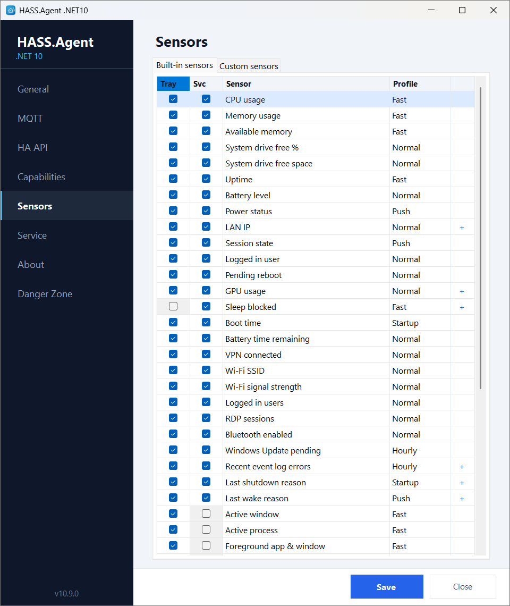
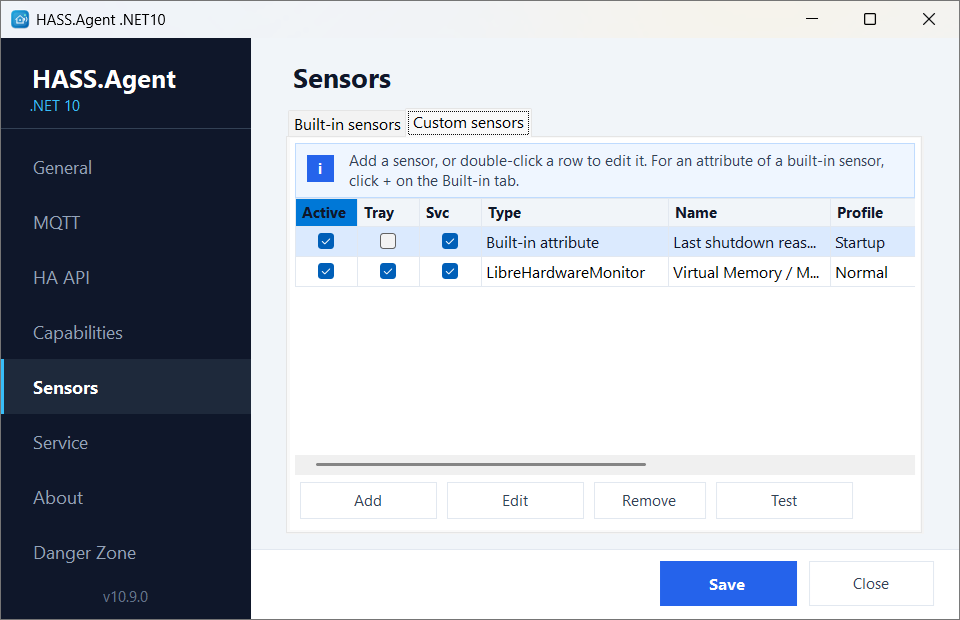
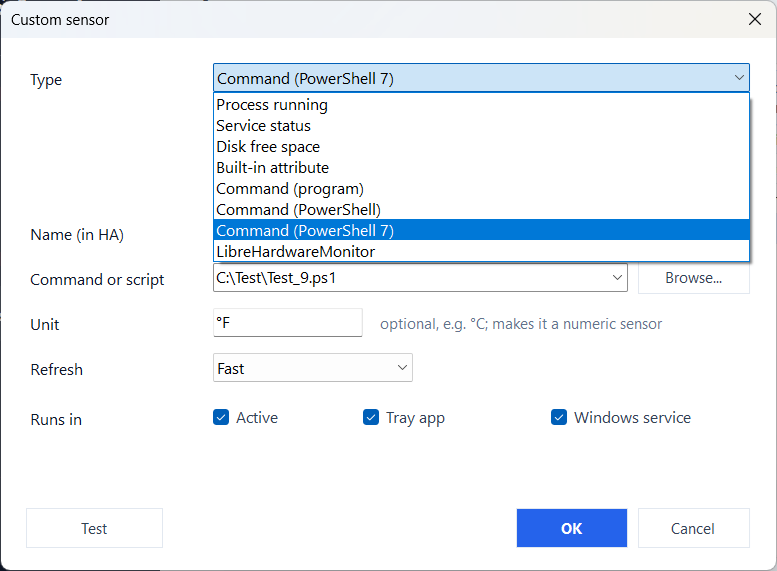

# Sensors

[← Back to the README](https://github.com/v1k70rk4/HASS.Agent.NET10#readme)

## Built-in Sensors

The **Sensors** page has two tabs: **Built-in sensors** and **Custom sensors**.

Built-in sensors are predefined system metrics. Each one can be enabled/disabled independently and assigned to the tray app, the service, or both.

The **Default** column shows whether a fresh install starts with the sensor switched on. Sensors that are useful, but not to everyone, start **off** so they do not clutter Home Assistant — enable them on the *Sensors* page. An update never changes a setting you already have: a sensor added by a new version simply arrives switched off.

| Sensor | Profile | Service | Tray | Default |
|--------|---------|:---:|:---:|:---:|
| CPU usage | fast | yes | yes | on |
| GPU usage | normal | yes | yes | off |
| Memory usage | fast | yes | yes | on |
| Available memory (MB) | fast | yes | yes | on |
| System drive free % | normal | yes | yes | on |
| System drive free (GB) | normal | yes | yes | on |
| Uptime | fast | yes | yes | on |
| Boot time | startup | yes | yes | on |
| Battery level | normal | yes | yes | on |
| Battery time remaining | normal | yes | yes | on |
| Power status | **push** | yes | yes | on |
| LAN IP | normal | yes | yes | on |
| Session state | **push** | yes | yes | on |
| Logged in user | normal | yes | yes | on |
| Logged in users (count) | normal | yes | yes | on |
| RDP sessions | normal | yes | yes | off |
| Pending reboot | normal | yes | yes | on |
| Sleep blocked | fast | yes | | off |
| VPN connected | normal | yes | yes | off |
| Wi-Fi SSID | normal | yes | yes | on |
| Wi-Fi signal | normal | yes | yes | on |
| Bluetooth enabled | normal | yes | yes | on |
| Windows Update pending | hourly | yes | yes | on |
| Recent Event Log errors | hourly | yes | yes | off |
| Last shutdown reason | startup | yes | yes | off |
| Last wake reason | **push** | yes | yes | off |
| Active window | fast | | yes | on |
| Active process | fast | | yes | on |
| Foreground app & window | fast | | yes | on |
| Volume | **push** | | yes | on |
| Muted | **push** | | yes | on |
| Monitor power state | **push** | | yes | on |
| Active displays | normal | | yes | on |
| Idle time | fast | | yes | on |
| Session locked | **push** | | yes | on |
| User present | **push** | | yes | on |
| Clipboard text available | fast | | yes | off |
| Camera in use | fast | | yes | off |
| Microphone in use | fast | | yes | off |
| Audio input device | **push** | | yes | off |
| Audio sessions | normal | | yes | off |
| Display brightness | **push** | | yes | off |
| Audio output device | **push** | | yes | on |
| Microphone muted | **push** | | yes | on |

<p align="center"></p>

## Sensor Attributes

Some sensors have a simple primary state but expose richer details as attributes. These attributes can be extracted into separate Home Assistant entities using the `built_in_attribute` custom sensor type (see [Custom Sensors](#custom-sensors)).

Sensors with attributes:

| Sensor | Attributes |
|--------|-----------|
| **LAN IP** | `addresses[N].adapter`, `addresses[N].description`, `addresses[N].address` |
| **Active displays** | `displays[N].name`, `displays[N].primary`, `displays[N].width`, `displays[N].height`, `displays[N].x`, `displays[N].y` |
| **Recent Event Log errors** | `window_minutes`, `events[N].log`, `events[N].provider`, `events[N].event_id`, `events[N].level`, `events[N].created_at` |
| **Last shutdown reason** | `reason`, `event_id`, `created_at`, `message` |
| **Last wake reason** | `source`, `kind` (`modern_standby`, `sleep`, `hibernate`, `fast_startup`), `created_at`, `duration_seconds`, `sleep_entered`, `detail` |
| **Sleep blocked** | `system_required`, `display_required`, `away_mode_required`, `primary_blocker`, `blockers[N].category`, `blockers[N].type`, `blockers[N].name`, `blockers[N].reason`, `blockers[N].blocking` |
| **GPU usage** | `engines.<type>` (e.g. `engines.3d`, `engines.videodecode`), `npu_usage`, `memory_dedicated_mb`, `memory_shared_mb`, `adapters[N].name`, `adapters[N].memory_mb` |
| **Camera in use** / **Microphone in use** | `apps[N]` |

## Sensor Polling Profiles

Sensors are refreshed by profile instead of one global interval. Each profile interval is configurable in the app:

| Profile | Default | Description |
|---------|---------|-------------|
| **push** | on change | Event-driven — reports within ~600 ms of a change (monitor power, session lock, power source, volume/mute/audio device). A poll still runs as a safety net. *Last wake reason* follows the event log and is published with the next fast cycle. |
| **fast** | 10 sec | CPU, memory, active window, etc. |
| **normal** | 60 sec | Disk, battery, network, Bluetooth, etc. |
| **hourly** | 3600 sec | Windows Update, Event Log, etc. |
| **startup** | once | Boot time, last shutdown reason |

Minimum interval is 10 seconds for the timed profiles.

## Availability

The device publishes its online/offline state to Home Assistant — over MQTT with a **Last Will** message, and over the HA API transport with a **heartbeat**. On a clean shutdown, a crash, or a network loss, the entities turn **unavailable** in Home Assistant instead of keeping their last value.

## Custom Sensors

Custom sensors are parameterized sensors you can add multiple times with different settings. Each custom sensor has:

- **Type** - what kind of sensor it is
- **Name** - the entity name in Home Assistant
- **Parameter** - what to monitor (depends on type)
- **Unit** - optional unit of measurement shown in Home Assistant (marks the sensor as a numeric `measurement`)
- **Profile** - polling interval (fast / normal / hourly / startup)

<p align="center"></p>

**Add**, or a double click on a row, opens the editor: it explains the chosen type, offers what the PC has (running processes, services, drives, built-in attributes, LibreHardwareMonitor values), and **Test** shows the value the sensor would report.

<p align="center"></p>

### `process_running`

Checks whether a Windows process is currently running.

| Field | Example |
|-------|---------|
| Parameter | `notepad` or `chrome.exe` |
| State | `true` / `false` |

The `.exe` extension is optional. The check uses `Process.GetProcessesByName()`, so it matches the process name without path.

**Use case**: trigger an automation when a specific application starts or stops.

```text
Name: "Chrome running"
Parameter: chrome
```

### `service_status`

Reads the status of a Windows service.

| Field | Example |
|-------|---------|
| Parameter | `Spooler` or `wuauserv` |
| State | `running`, `stopped`, `paused`, etc. |

Use the exact Windows service name (not the display name). You can find it in `services.msc` or with `Get-Service` in PowerShell.

**Use case**: monitor whether a critical service is running (database, backup agent, print spooler).

```text
Name: "Print Spooler"
Parameter: Spooler
```

### `disk_free`

Reports the free space on a drive in GiB.

| Field | Example |
|-------|---------|
| Parameter | `D` or `D:` or `D:\` |
| State | `123.4` (GiB) |

Any of the three formats work. The sensor reports as a numeric `measurement` with unit `GiB`.

**Use case**: alert when a data drive is running low on space.

```text
Name: "Data drive free"
Parameter: D
```

### `built_in_attribute`

Extracts a single value from a built-in sensor's attribute tree and exposes it as a standalone sensor entity.

This is the most powerful custom sensor type. Some built-in sensors (like LAN IP, Active displays, Event Log errors) return structured data with multiple values. The `built_in_attribute` type lets you drill into that structure and pull out one specific value.

| Field | Example |
|-------|---------|
| Parameter | `network_address.addresses[0].address` |
| State | `192.168.1.42` |

**Path syntax:**

The parameter is a dot-separated path into the sensor's attribute JSON. Array elements use `[index]` notation:

```text
sensor_key.property.nested_property
sensor_key.array[0].property
sensor_key.array[0].nested[1].value
```

**Available attribute paths:**

| Built-in sensor | Attribute path | Value |
|----------------|---------------|-------|
| LAN IP | `network_address.addresses[0].adapter` | Adapter name |
| LAN IP | `network_address.addresses[0].description` | Adapter description |
| LAN IP | `network_address.addresses[0].address` | IPv4 address |
| Active displays | `active_display.displays[0].name` | Display name |
| Active displays | `active_display.displays[0].primary` | Primary flag |
| Active displays | `active_display.displays[0].width` | Width in pixels |
| Active displays | `active_display.displays[0].height` | Height in pixels |
| Active displays | `active_display.displays[0].x` | X position |
| Active displays | `active_display.displays[0].y` | Y position |
| Event Log errors | `event_log_errors_recent.window_minutes` | Lookup window |
| Event Log errors | `event_log_errors_recent.events[0].log` | Log name |
| Event Log errors | `event_log_errors_recent.events[0].provider` | Source |
| Event Log errors | `event_log_errors_recent.events[0].event_id` | Event ID |
| Event Log errors | `event_log_errors_recent.events[0].level` | Level |
| Event Log errors | `event_log_errors_recent.events[0].created_at` | Timestamp |
| Last shutdown reason | `last_shutdown_reason.reason` | Reason text |
| Last shutdown reason | `last_shutdown_reason.event_id` | Event ID |
| Last shutdown reason | `last_shutdown_reason.created_at` | Timestamp |
| Last shutdown reason | `last_shutdown_reason.message` | Full message |
| Last wake reason | `last_wake_reason.source` | What woke the machine |
| Last wake reason | `last_wake_reason.kind` | `modern_standby`, `sleep`, `hibernate` or `fast_startup` |
| Last wake reason | `last_wake_reason.created_at` | Timestamp |
| Last wake reason | `last_wake_reason.duration_seconds` | How long it was away |
| Last wake reason | `last_wake_reason.sleep_entered` | `false` when only the screen was off |
| Last wake reason | `last_wake_reason.detail` | Waking device or wake timer owner |
| Sleep blocked | `sleep_blocked.primary_blocker` | First holder that really blocks sleep |
| Sleep blocked | `sleep_blocked.system_required` | System request held |
| Sleep blocked | `sleep_blocked.display_required` | Display request held |
| Sleep blocked | `sleep_blocked.away_mode_required` | Away mode request held |
| Sleep blocked | `sleep_blocked.blockers[0].name` | Holder (process, service or driver) |
| Sleep blocked | `sleep_blocked.blockers[0].reason` | Reason given by the holder |
| GPU usage | `gpu_usage.engines.3d` | 3D engine load (%) |
| GPU usage | `gpu_usage.engines.videodecode` | Video decode load (%) |
| GPU usage | `gpu_usage.npu_usage` | NPU load (%) |
| GPU usage | `gpu_usage.memory_dedicated_mb` | Dedicated GPU memory in use |
| GPU usage | `gpu_usage.memory_shared_mb` | Shared GPU memory in use |
| GPU usage | `gpu_usage.adapters[0].name` | Adapter name |
| GPU usage | `gpu_usage.adapters[0].memory_mb` | Adapter memory size |
| Camera in use | `camera_in_use.apps[0]` | App using the camera |
| Microphone in use | `microphone_in_use.apps[0]` | App using the microphone |

> **Tip — auto-create from built-in sensors**: Some built-in sensors publish multiple values (LAN IP, Active displays, Event Log errors, Last shutdown reason). In the **Built-in sensors** tab these sensors show a **+** icon next to their name. Clicking **+** automatically creates a `built_in_attribute` custom sensor for **every** available attribute path of that sensor. Each one becomes a separate Home Assistant entity.
>
> For example, clicking **+** on **LAN IP** creates three custom sensors: adapter name, adapter description, and IPv4 address. Clicking **+** on **Event Log errors** creates six: window minutes, log name, provider, event ID, level, and timestamp. You can delete any you don't need from the Custom sensors tab.
>
> This is the easiest way to get individual entities from multi-value sensors — no need to type attribute paths manually.

**Example:** To get the second network adapter's IP address:

```text
Name: "Secondary adapter IP"
Parameter: network_address.addresses[1].address
```

**Example:** To get the last shutdown reason:

```text
Name: "Last shutdown"
Parameter: last_shutdown_reason.reason
```

### `lhm` (LibreHardwareMonitor)

Reads a hardware value from a running [LibreHardwareMonitor](https://github.com/LibreHardwareMonitor/LibreHardwareMonitor): CPU and GPU temperature, fan speed, voltage, load. The agent has no vendor-specific hardware code of its own; LibreHardwareMonitor does the reading and the agent asks it.

1. Run LibreHardwareMonitor and turn on **Options > Remote Web Server > Run** (port 8085 by default). Let it start with Windows if the sensor should always work.
2. Add a custom sensor of the type **LibreHardwareMonitor**. The **Sensor** field lists everything LibreHardwareMonitor reports, with the current value; picking one fills in the unit, and the name when it is empty.

- The parameter is LibreHardwareMonitor's own sensor id (e.g. `/amdcpu/0/temperature/2`).
- The value is null while LibreHardwareMonitor is not running.
- The **Connection...** button next to the field sets a different address or port (default `http://localhost:8085`), and the user name and password when LibreHardwareMonitor's web server is set to ask for them.
- No Home Assistant integration update is required.

```text
Name: "CPU temperature"
Type: LibreHardwareMonitor
Parameter: /amdcpu/0/temperature/2
Unit: °C
Profile: normal
State: 45.5 °C
```

### `command` / `command_powershell` / `command_pwsh`

Runs a program or PowerShell script and uses its **output** as the sensor value — for anything Windows has no built-in sensor for, such as GPU temperature.

| Type | Parameter | Runs as |
|------|-----------|---------|
| **Command (program)** | A program or full command line (e.g. `nvidia-smi --query-gpu=temperature.gpu --format=csv,noheader,nounits`) | The executable directly (fast, no shell) |
| **Command (PowerShell)** | An inline command or a `.ps1` path | `powershell.exe -NoProfile -ExecutionPolicy Bypass` |
| **Command (PowerShell 7)** | Same as above | `pwsh.exe -NoProfile -ExecutionPolicy Bypass` |

- The **first non-empty line** of the output (trimmed, max 255 chars) becomes the sensor state — format your command to print a single value. A plain number is published as a numeric value.
- Set an optional **Unit** (e.g. `°C`) to show it in Home Assistant; a unit also marks the sensor as a numeric `measurement`, so Home Assistant keeps long-term statistics and graphs it.
- Each run has a timeout (~10 s) so a hung command can't stall reporting. Pick the **Normal** or **Hourly** profile, not Fast.
- **Security**: you define what runs — Home Assistant only reads the resulting value, it cannot send commands. No Home Assistant integration update is required for these.

```text
Name: "GPU temperature"
Type: Command (program)
Parameter: nvidia-smi --query-gpu=temperature.gpu --format=csv,noheader,nounits
Unit: °C
Profile: normal
State: 54 °C
```
